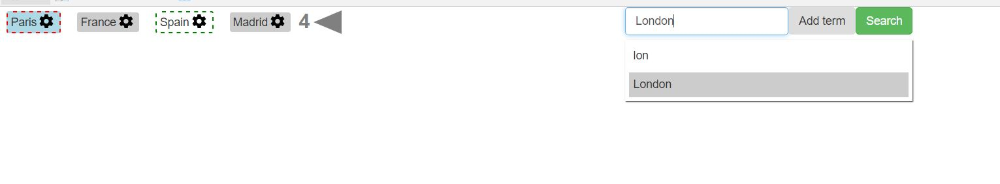
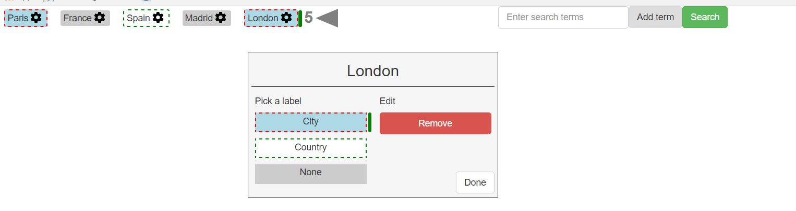

# React + Bootstrap powered search box component


<br>
<br>

## What it does

* Lets you enter multiple search terms as visual tags
* Each term can be configured with additional labels/metadata
* Predefined set of terms can be displayed upon initial loading
* Covers only the view layer and therefore expects callback functions which will be invoked with the current terms as the only parameter:
    - Terms change: remove/add
    - Search press
    
### Live Demo: [Click here](https://zdravkokirilov.github.io/react-tags-searchbox/)

#### Example of prepopulated terms formatting

```javascript

const terms = [
    {
        value: 'Paris',
        label: 'City'
    }, {
        value: 'France',
        label: null
    }, {
        value: 'Spain',
        label: null
    }, {
        value: 'Madrid',
        label: null
    }
];

```

#### Example of label configuration

````javascript
const labels = {
    City: {
        style: {
            border: '2px dashed red',
            background: 'lightblue'
        },
        value: 'City'
    },
    Country: {
        style: {
            border: '2px dashed green',
            background: 'white'
        },
        value: 'Country'
    }
};
````

#### Example of suggestions format

````javascript
const suggestions = ['city:Sofia', 'Sofia', 'country:Bulgaria', 'Bulgaria', 'London', 'England'];
````

#### Example of required callbacks

````javascript
function onSearchPress(terms) {
    console.log(terms);
}
function onTermsChange(terms) {
    console.log(terms);
}
````

#### Using the component

````javascript
ReactDOM.render(
    <Searchbox
        enteredTerms={terms}
        labels={labels}
        onSearchPress={onSearchPress}
        suggestionsPool={suggestions}
        onTermsChange={onTermsChange}/>, document.getElementById('root'));
````

#### Running a demo

```` javascript
npm install
npm start
````


